# DynaDUSt3R

<p align="center">
  
</p>


Unofficial reimplementation of **DynaDUSt3R** trained on **Stereo4D**. The Stereo4D paper details a DynaDUSt3R implementation but does **not** release model weights; this repo recreates that training pipeline based on the paper description and public **DUSt3R** code — for research purposes only.

**Links:** [Stereo4D paper (CVPR 2025)](https://openaccess.thecvf.com/content/CVPR2025/papers/Jin_Stereo4D_Learning_How_Things_Move_in_3D_from_Internet_Stereo_CVPR_2025_paper.pdf) · [arXiv](https://arxiv.org/abs/2412.09621) · [Project page](https://stereo4d.github.io/) · [Processing code](https://github.com/Stereo4d/stereo4d-code)

**Datasets:** [Stereo4D annotations (GCS)](https://console.cloud.google.com/storage/browser/stereo4d) · [Left-eye perspective (HF)](https://huggingface.co/datasets/KevinMathew/stereo4d-lefteye-perspective) · [Right-eye perspective (HF)](https://huggingface.co/datasets/KevinMathew/stereo4d-righteye-perspective) *(not used in this training)*

**Pretrained weights:** [DynaDUSt3R (HF)](https://huggingface.co/KevinMathew/dynadust3r-unofficial-weights) — ADT benchmark scores are listed on the repo page · **Training**: ~29 hours, 4xH100 GPUs, 98k iterations, batch-size 16 (grad acc: 2 iterations).

---

## example viz
<!-- Column headers -->
<table width="100%">
  <tr>
    <td width="50%" align="center"><b>Input</b></td>
    <td width="50%" align="center"><b>Point + Motion Map Predictions</b></td>
  </tr>
</table>

<!-- Examples -->
<table width="100%">
  <tr>
    <td width="50%" align="center">
      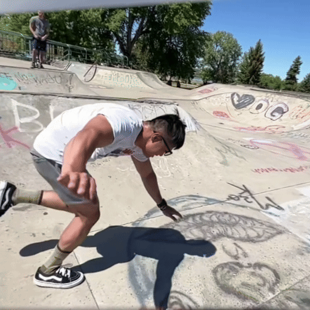
    </td>
    <td width="50%" align="center">
      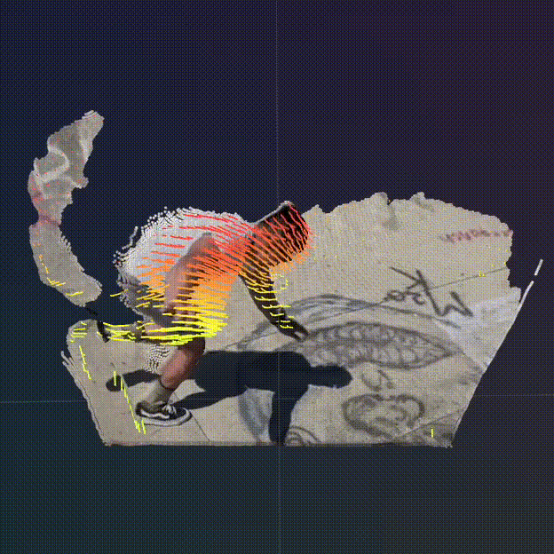
    </td>
  </tr>
</table>

<table width="100%">
  <tr>
    <td width="50%" align="center">
      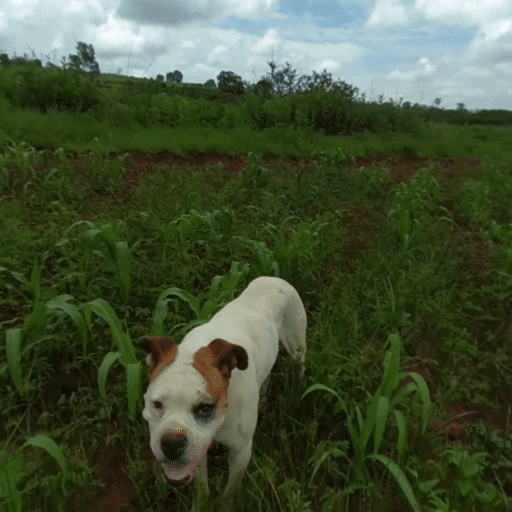
    </td>
    <td width="50%" align="center">
      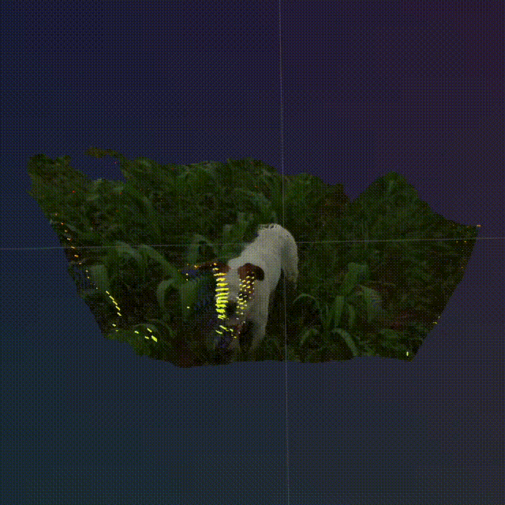
    </td>
  </tr>
</table>

<table width="100%">
  <tr>
    <td width="50%" align="center">
      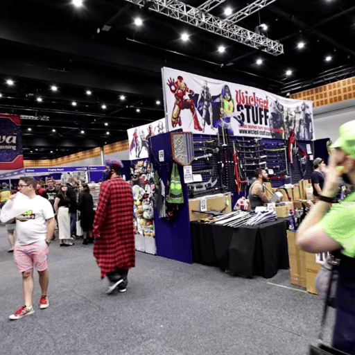
    </td>
    <td width="50%" align="center">
      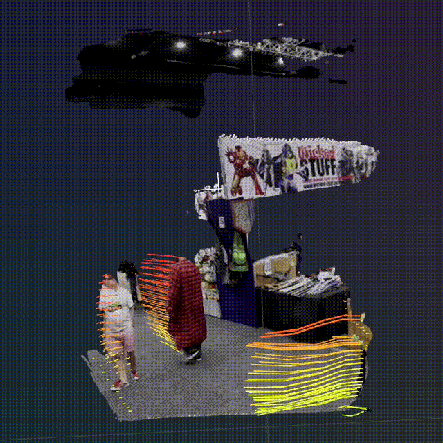
    </td>
  </tr>
</table>

<table width="100%">
  <tr>
    <td width="50%" align="center">
      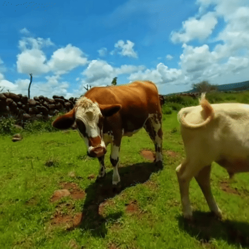
    </td>
    <td width="50%" align="center">
      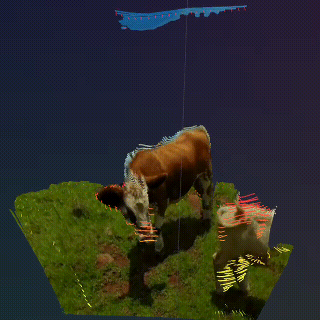
    </td>
  </tr>
</table>

<table width="100%">
  <tr>
    <td width="50%" align="center">
      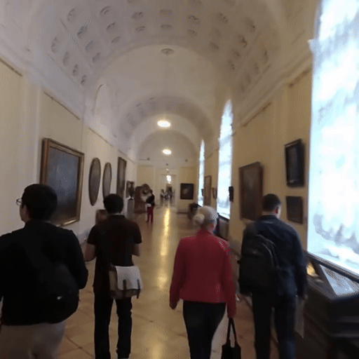
    </td>
    <td width="50%" align="center">
      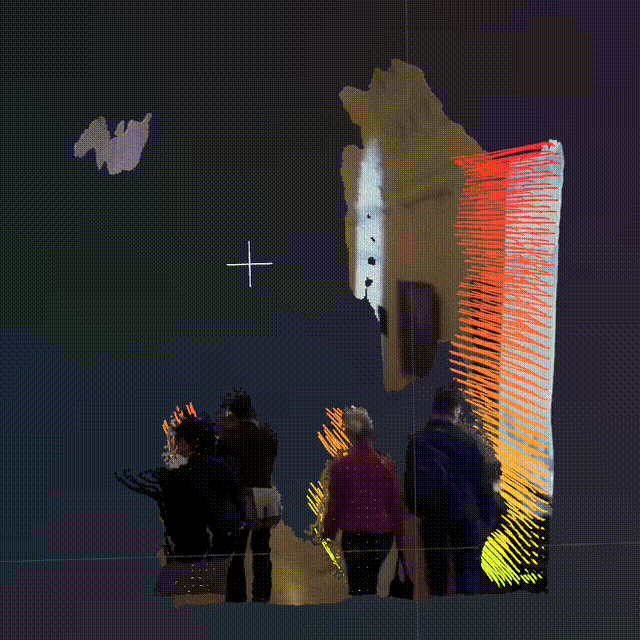
    </td>
  </tr>
</table>

<table width="100%">
  <tr>
    <td width="50%" align="center">
      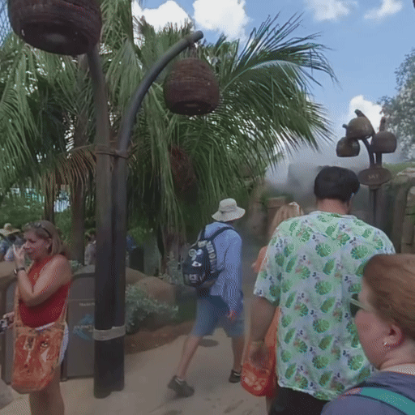
    </td>
    <td width="50%" align="center">
      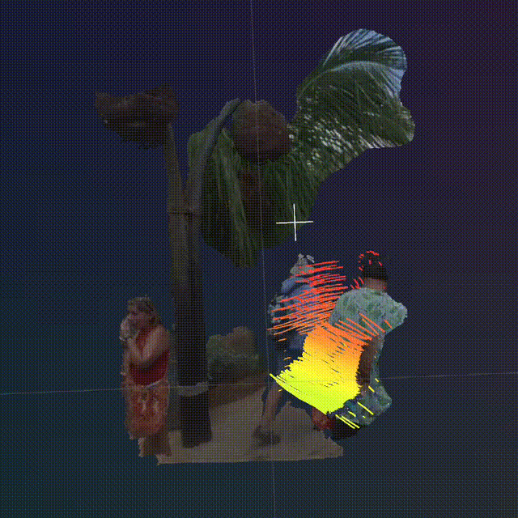
    </td>
  </tr>
</table>

---

## table of contents
- quick start
- install
  - build the `curope` cuda op
- datasets
  - stereo4d (download, layout, convert to webdataset)
- training
  - cli basics & config structure
  - single-gpu / multi-gpu
  - checkpoints, logs, viz
- configuration reference
- troubleshooting
- license

---

## quick start

```bash
# clone
git clone https://github.com/KevinMathewT/dynadust3r-unofficial.git
cd dynadust3r-unofficial

# env (poetry or pip)
poetry install
# or (export deps from poetry to requirements and install with pip)
pip install -r <(poetry export -f requirements.txt --without-hashes)

# build the local cuda op (see section below)
export TORCH_CUDA_ARCH_LIST="7.5;8.0;9.0+PTX"
pip install -v --no-build-isolation -e models/croco/curope

# train (direct-from-disk; no WebDataset needed)
# ensure you downloaded mp4s + npz files as in the Datasets section
python -m train data.loader=stereo4d \
  dataset.stereo4d.path=/data/stereo4d \
  dataset.stereo4d.lefteye_dir=/data/stereo4d/lefteye-perspective \
  dataset.stereo4d.sequences_csv=$(pwd)/utils/data/stereo4d_all_sequences.csv  # absolute path recommended

# (optional) Use WebDataset streaming instead of direct-from-disk
# 1) Create shards (see Datasets → convert to WebDataset)
#    python extras/preprocess_stereo4d.py \
#      dataset.stereo4d.path=/data/stereo4d \
#      dataset.stereo4d.lefteye_dir=/data/stereo4d/lefteye-perspective
# 2) In loaders/__init__.py, switch the mapping to Stereo4DWDSStream
#    (comment out the Stereo4D line and uncomment the Stereo4DWDSStream line)
# 3) Train (same CLI, optionally set wds_dir if not under /data/stereo4d/wds)
#    python -m train data.loader=stereo4d \
#      dataset.stereo4d.path=/data/stereo4d \
#      dataset.stereo4d.wds_dir=/data/stereo4d/wds
```

---

## install

### build the `curope` cuda op

```bash
export TORCH_CUDA_ARCH_LIST="7.5;8.0;9.0+PTX"
pip install -v --no-build-isolation -e models/croco/curope
```

Builds `curope` against your current torch install. Make sure you have a CUDA-enabled torch and toolkit; adjust `TORCH_CUDA_ARCH_LIST` to match your GPU (e.g., `7.5;8.0;9.0+PTX`).

---

## datasets

### stereo4d (required for default runs)

**what it is.** Internet VR180 (stereoscopic) videos processed into per-frame camera poses, 3D tracks, and rectification. We train on the **left-eye perspective** clips (512×512 @ ~60° FoV) paired with official `.npz` annotations.

#### what you download
- **annotations (.npz)** from Google Cloud Storage: `gs://stereo4d/{train,test}/*.npz`.
 - **left-eye perspective mp4s** from Hugging Face: `KevinMathew/stereo4d-lefteye-perspective` (tar archives of **plain mp4s**, not WebDataset). Optionally convert them to WebDataset with our script in `extras/` if you want to use the streaming loader.
- **right-eye perspective mp4s** from Hugging Face: `KevinMathew/stereo4d-righteye-perspective` *(not used in this training, listed for completeness).*

#### download: annotations (.npz) from GCS
```bash
# install / init gcloud (linux example)
curl -O https://dl.google.com/dl/cloudsdk/channels/rapid/downloads/google-cloud-cli-linux-x86_64.tar.gz
tar -xf google-cloud-cli-linux-x86_64.tar.gz
./google-cloud-sdk/install.sh
./google-cloud-sdk/bin/gcloud init

# single file example
mkdir -p /data/stereo4d/train /data/stereo4d/test
gcloud storage cp gs://stereo4d/train/CMwZrkhQ0ck_130030030.npz /data/stereo4d/train

# full dataset (mirrors gs://stereo4d under /data/) — multi-TB
gsutil -m cp -R gs://stereo4d /data/
```

Each `.npz` contains (clip-level):  
`name` (e.g., `<videoid>_<timestamp>`), `video_id`, `timestamps`, `camera2world` (per-frame), `track_lengths`, `track_indices`, `track_coordinates` (3D tracks), `rectified2rig` (rectification rotation), `fov_bounds` (VR180 intrinsics).

#### download: left-eye perspective mp4s from HF
```bash
git clone https://huggingface.co/datasets/KevinMathew/stereo4d-lefteye-perspective
cd stereo4d-lefteye-perspective

# pull parts and reconstruct tarballs
git lfs pull --include="*.tar.part_*,test_mp4s.tar"
cat train_mp4s.tar.part_* > train_mp4s.tar

# extract mp4s to your data root
mkdir -p /data/stereo4d/lefteye-perspective/train /data/stereo4d/lefteye-perspective/test
tar -xvf train_mp4s.tar -C /data/stereo4d/lefteye-perspective/train
tar -xvf test_mp4s.tar  -C /data/stereo4d/lefteye-perspective/test
```
Files are named like `<videoid>_<timestamp>-left_rectified.mp4`.

#### recommended on-disk layout (before conversion)
```
/data/stereo4d/
  ├── train/*.npz
  ├── test/*.npz
  ├── lefteye-perspective/
  │   ├── train/*.mp4   # <videoid>_<timestamp>-left_rectified.mp4
  │   └── test/*.mp4
```


---

### convert to **webdataset** shards (optional)

We merge **mp4** (left-eye perspective) + **npz** annotations per clip into WebDataset samples (triplets per sample) with keys expected by the streaming loader (set `image_format=npy`):
- `l.npy`, `m.npy`, `r.npy` — left/mid/right frames as uint8 HWC arrays
- `l.pv.npy`, `m.pv.npy`, `r.pv.npy` — per-point 3D tracks with validity `(T,4)`
- `l.cam.npy`, `m.cam.npy`, `r.cam.npy` — extrinsics `(4,4)` world-to-camera
- `k.npy` — intrinsics `(3,3)` computed from frame width and `hfov`
- `__key__` — `<seq>_<l>_<m>_<r>`

Output structure:
```
/data/stereo4d/wds/
  ├── train/
  │   ├── stereo4d-w00-000000.tar
  │   ├── stereo4d-w00-000000.idx
  │   ├── stereo4d-w00-000001.tar
  │   ├── stereo4d-w00-000001.idx
  │   ├── stereo4d-w01-000000.tar
  │   ├── stereo4d-w01-000000.idx
  │   └── ...
  └── test/
      ├── stereo4d-w00-000000.tar
      ├── stereo4d-w00-000000.idx
      └── ...
```

#### DALI indexing (optional, recommended)

NVIDIA DALI provides fast readers for WebDataset when you generate `.idx` files for each `.tar`.

- Verify the DALI indexer CLI is available:
```bash
wds2idx --help
```

Indexing runs automatically when you execute the preprocessor (default enabled); see the command under “run the preprocessor” below.

 

How this repo triggers indexing:
- The preprocessor calls DALI’s `wds2idx` automatically at the end (step 6.5) if `+preproc.make_dali_index=true` (default).
- It derives the shard glob from the base pattern (default `stereo4d-%06d.tar`), which also matches worker-tokenized names like `stereo4d-w00-000123.tar`.
- Indices are written next to shards as `*.idx` files (e.g., `stereo4d-w00-000123.idx`).
- It runs indexing in parallel (up to `+preproc.num_workers`), and safely skips indexing if `wds2idx` is not on PATH.
- You can override the base naming with `+preproc.wds_pattern=...</custom-%06d.tar>` if needed.

#### run the preprocessor

```bash
# base invocation with hydra overrides for paths (npy images for streaming)
python extras/preprocess_stereo4d.py \
  dataset.stereo4d.path=/data/stereo4d \
  dataset.stereo4d.lefteye_dir=/data/stereo4d/lefteye-perspective \
  dataset.stereo4d.hfov=60 \
  +preproc.split=train \
  +preproc.image_format=npy
```

**Important knobs (Hydra overrides; no file edits required):**
- `+preproc.split={train|test}`
- `+preproc.num_workers=<int>`
- `+preproc.shard_size_gb=<float>`, `+preproc.samples_per_shard=<int>`

The script will (high-level, matching code):
1) Environment & output
   - Set cache/temp envs to `cfg.dataset.stereo4d.cache` (`WIDS_CACHE`, `TMPDIR`, etc.).
   - Choose output dir: `dataset.stereo4d.wds_dir` or `<path>/wds/<split>`.
   - Base pattern: `stereo4d-%06d.tar`; writers insert tokens → `stereo4d-wXX-%06d.tar`.
2) Discover sequences (filesystem)
   - Scan `lefteye-perspective/<split>` for `*-left_rectified.mp4` and pair with `<path>/<split>/*.npz`.
   - Build a list of `(seq_id, mp4_path, npz_path)` only when both exist.
3) Lightweight counting (batched, parallel)
   - For selected sequences, read MP4 length and width via Decord (cheap header access).
   - Read NPZ frame count from `camera2world.shape[0]`.
   - Keep `n_min = min(n_mp4, n_npz)` (or whichever is valid); done in batches via `ProcessPoolExecutor`.
4) Uniform triplet presampling (global over all sequences)
   - Respect `max_frame_window` (from config unless overridden).
   - Sample `(l, m, r)` uniformly over ALL valid triplets across the population (gap-weighted) until `num_triplets`.
   - Ensure uniqueness of triplets; cap if the requested count exceeds the population.
5) Group & partition work (by sequence)
   - Group triplets per sequence to minimize re-opening mp4/npz.
   - Greedy bin-pack sequences across writer workers by triplet count (balanced workload).
6) Write shards (parallel producers)
   - Each worker opens its own WebDataset `ShardWriter` (tokenized pattern), rotates by size (`shard_size_gb`) or count (`samples_per_shard`).
   - Per sequence: open `VideoReader` once, open NPZ once, compute `K` from frame width and `hfov`.
   - For each `(l, m, r)`: write keys
     - `l.npy|m.npy|r.npy` (or `.jpg` if `image_format=jpg`)
     - `l.pv.npy|m.pv.npy|r.pv.npy` (tracks with validity)
     - `l.cam.npy|m.cam.npy|r.cam.npy` (extrinsics, world→camera)
     - `k.npy` (intrinsics 3×3), `seq.txt`
7) Optional ordered verification (`+preproc.verify=true`)
   - For each worker token, stream that worker’s shards (no shuffle) and compare sample-by-sample against ground truth decoded from mp4/npz.
   - Check image content/shape, tracks, intrinsics/extrinsics, and key order; report stats.
8) Optional DALI indexing (`+preproc.make_dali_index=true`)
   - Run `wds2idx` over all matching shard files in parallel; write `*.idx` next to each `.tar`.
   - Skips gracefully if `wds2idx` is not on PATH.

> tip: put TMP/WIDS cache on fast local scratch; adjust envs at the top of the script.

**What the dataloader expects**:
- Direct loader (`loaders/stereo4d.py`, default):
  - On-disk mp4s under `lefteye-perspective/{split}` and `.npz` under `{split}`
  - A sequences CSV via `dataset.stereo4d.sequences_csv`
- Streaming loader (`loaders/stereo4d_stream.py`, optional):
  - Shards matching `.../wds/{split}/stereo4d-*.tar` (or set `dataset.stereo4d.wds_dir`)
  - Per-sample keys: `l.npy|m.npy|r.npy`, `l.pv.npy|m.pv.npy|r.pv.npy`, `l.cam.npy|m.cam.npy|r.cam.npy`, `k.npy`

---

## training

### cli basics & config structure

Hydra entrypoint: `@hydra.main(config_path="config", config_name="config")`.

Key knobs:
- `data.loader` (default `stereo4d`)
- `data.size`, `data.batch_size`
- `train.iterations`, `train.validation_frequency`
- `train.grad_acc` (gradient accumulation steps)
- `logging.use_wandb`
- `sched` (`cosine`, `linear`, `onecycle`, `steplr`, `exponentiallr`, `reducelronplateau`) or leave unset to disable scheduler

Override any leaf via CLI:
```bash
python -m train \
  data.loader=stereo4d \
  dataset.stereo4d.path=/data/stereo4d \
  dataset.stereo4d.lefteye_dir=/data/stereo4d/lefteye-perspective \
  dataset.stereo4d.sequences_csv=$(pwd)/utils/data/stereo4d_all_sequences.csv \
  data.batch_size=4 train.iterations=49000 train.validation_frequency=1000 \
  logging.use_wandb=true
```

Notes:
- `data.len` and `data.valid_len` are computed automatically from `train.iterations × data.batch_size × WORLD_SIZE`; no manual sizing needed.
- If `debug=true`, the script uses a tiny dataset and sets `train.grad_acc=1`, `data.batch_size=4`, frequent viz, and short validation periods.

### multi-gpu
```bash
# accelerate
accelerate launch -m train data.loader=stereo4d ...
# or (inside Poetry)
poetry run accelerate launch -m train data.loader=stereo4d ...

# torchrun
torchrun --nproc_per_node=8 -m train data.loader=stereo4d ...

# slurm (template provided)
sbatch extras/train_dynadust3r.sbatch
```

### checkpoints, logs, viz
- Enable W&B via `logging.use_wandb=true` (initialized only on main process).
- Visualizations:
  - Training: saved every 250 iterations by default (every 5 in debug) in the Hydra run directory.
  - Validation: saved after each validation phase under the Hydra run dir at `.../valid/...`.
- Checkpoints (under `.../checkpoints/`):
  - Best: `best_<metric>_<value>_iter_<N>_epoch_<E>.pth` (top‑K kept; metric and value embedded in filename).
  - Last: `last_iter_<N>_epoch_<E>.pth` (always written at the end of training).

Distribution notes:
- Accelerate handles data parallelism and splits batches across GPUs. Use the full `data.batch_size` in config; do not divide it by the number of GPUs.

---

## configuration reference
- `config/config.yaml` – top-level defaults (training, data, logging)
- `config/model/dynadust3r.yaml` – model + DUSt3R weights
- `config/criterion/*.yaml` – loss configs
- `config/optim/*.yaml`, `config/sched/*.yaml` – optimizers & schedulers
- `config/dataset/stereo4d.yaml` – set `path`, `lefteye_dir`, `hfov`, `max_frame_window`, splits

---

## troubleshooting
- **curope build** → ensure you’re building against the torch in your current venv; rebuild with `--no-build-isolation` (see snippet above).
- **dataset pairing** → clip ids must match exactly: `<videoid>_<timestamp>` for both `.npz` and `-left_rectified.mp4`.
- **WIDS/webdataset performance** → keep cache/tmp on fast local scratch; tune workers & shard sizes.

---

## license
Parts of DUSt3R/CroCo are non-commercial (CC BY-NC-SA 4.0). Check headers under `models/dust3r/*` and `models/croco/*`.
